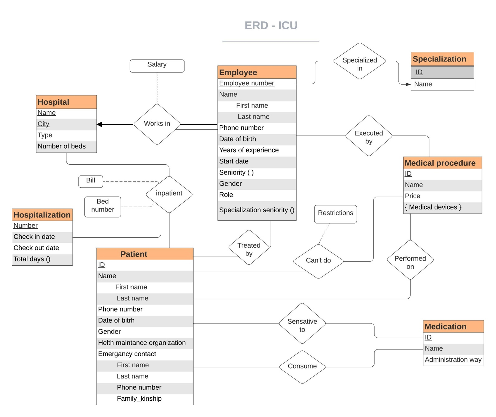
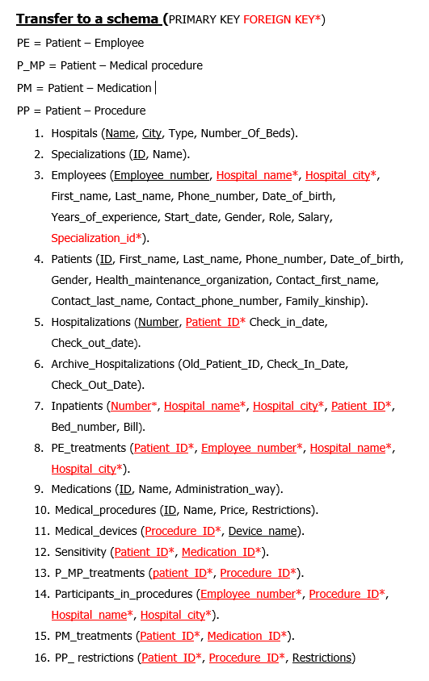
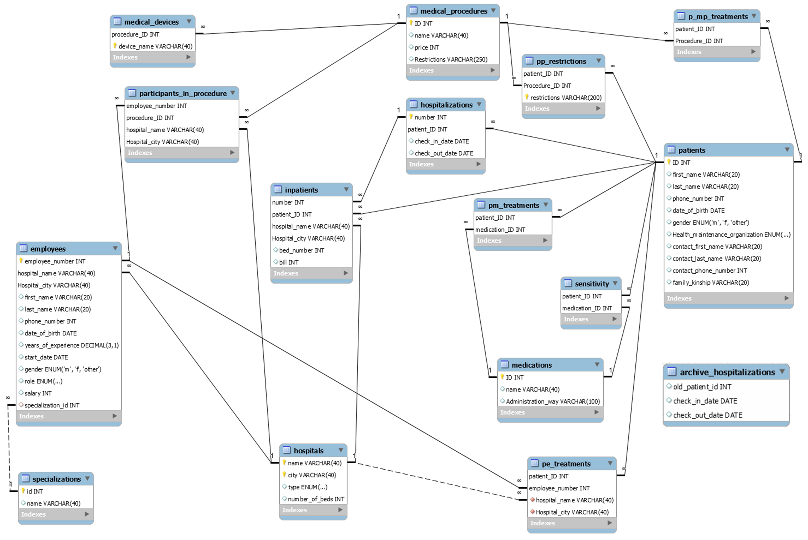

## Intensive Care Unit management system

	

## Introduction

Israel's hospitals have intensive care departments that provide life-saving treatments. Patients receive urgent care, including medical procedures and appropriate medication, based on their sensitivities and the therapist's role and specialization. Efficient conduct in intensive care units can save lives and prevent negligence. To streamline and improve the system, data must be organized and analyzed. The Ministry of Health requested the design of an information management system for all intensive care units, allowing for staff and patient monitoring, access to medical procedures and medication details, and financial management. The system must be user-friendly and serve both treating staff and the Ministry of Health personnel.

## Entities

#### Workers

Employees provide medical treatment and are employed by hospitals for a salary. In each department of a hospital there is a staff of therapists divided into:
* Nurses (when there is only one responsible nurse).
* Doctors are divided into: 
	* Interns 
	* Senior doctors
	* Department manager (only one).

Each employee in the department must keep the following details: employee ID, full name (personal and family), phone number, date of birth, number of years of experience (number of years that have passed since completing 7 years of medical studies), date of starting work at the hospital, gender, position, specialty (for nurses, NULL will be defined).

#### Internships

In each intensive care department, there are different specializations for doctors and interns, whose length is 5 years. The following must be saved: the internship ID, and the internship name.

#### Hospitals

Each care team worker is associated with a single hospital where he works. In addition, for every patient who was hospitalized in the past or is currently associated with a hospital where he/she was hospitalized, the following must be kept for each hospital: name of the hospital, city, type (private/government), number of beds in the intensive care unit.
There are chains of hospitals with the same name where the difference is in the city where each one is located.

#### Patients

For each patient, the following must be kept: social security number, name (personal and family), phone, date of birth, sex, health insurance, name of emergency contact (personal and family), phone number of emergency contact, and family relationship of the contact.
Patients have only one emergency contact.
During hospitalization, patients receive treatment, are admitted into a specific bed, and pay the hospital bill after their stay. They are treated, among others, by giving appropriate medications and, if treatment is necessary, medical procedures are performed. It should also be noted that patients are sensitive to certain medications and have different restrictions on performing different medical procedures.

#### Hospitalizations

A patient who has been hospitalized in an intensive care unit in the past or in the present must save his hospitalization number, the start date, and the end date.
If the patient is still in the hospital, the end date of the hospitalization will be worthless.

#### Medicines

In the wards, there are drugs given to patients. The following must be kept: the ID of the drug, the name of the drug, and the method of administration of the drug.

#### Medical procedures

On the wards, various procedures are performed on patients by the treating staff. You must keep the following: procedure ID, name of the procedure, price, and medical devices required for the procedure (there is no limit on the number of medical devices required for the procedure).

## ERD

	

## Assumptions

• One phone number for each employee, patient, and emergency contact.

• Each doctor has only one specialty.

• Each patient has one emergency contact, but multiple patients can have the same emergency contact.

• Each patient can have several doctors treating him, and each doctor can treat several patients.

• Several medical devices can be involved in a medical procedure.

• There is no limit to the amount of medication a patient can consume or tolerate.

• Each patient can be hospitalized several times, in different hospitals.

• Check-in date is before or the same as check-out.

• The number of patients in a department cannot be much higher than the number of beds in that department.

• An internship in medicine takes 5 years, then the intern becomes a senior doctor. Seniority in a specialty cannot be greater than doctor seniority.

• The number of beds will always be less than the total number of beds in the hospital.

• A patient will pay his bill only on the day of hospital discharge.

## System users

* Nurse

* A specialist doctor

* Senior doctor

* Department manager

* The representative of the Ministry of Health

## Transfer to schema

	

## Databse diagram

	

## Queries

#### INSERT/UPDATE/DELETE commands:

1. Reduction in hospitalizations from the past calendar year (2019)

(The deleted hospitalizations will be saved in the hospitalization archive table)

2. Update the number of beds in the "Meir" hospital

3. Adding an additional female doctor to "Barzilai" hospital

4. Adding an additional drug sensitivity for a patient

#### SELECT commands:

**Nurse:**

1. A patient wishes to move to a hospital near his home in Jerusalem. The nurse wants to check if there is an available bed in the intensive care unit at Hadassah Hospital in Jerusalem.

2. A nurse at the "Belinson" hospital wants to receive the list of patients on the ward and the relevant details about them. This includes full name, emergency contact name and phone number, and drug sensitivities.

3. A nurse at "Meir" hospital should check which patients in the department are sensitive to dopamine and/or epinephrine.

**Doctors (intern, senior, department manager):**

1. October is a month of many holidays with a variety of events and therefore accidents occur more frequently. This leads to more hospitalizations than usual. The director of the department at the "Blinson" hospital in PA is interested in knowing how many of these cases are short-term in terms of hospitalization, that is, they started and ended in the same month.

2. The director of the department at the "Raphael" Hospital in Tel Aviv wants to get a snapshot of the manpower of interns who are about to finish their internship in the coming year. This is with a minimum of 4 years of experience. All interns who meet the criteria must be presented and arranged in descending order according to their age.

3. The head of the department at the Tel Aviv "Raphael" hospital wants to be ranked according to seniority in the descending order of the senior doctors in his department.

4. A senior doctor at "Blinson" hospital, in Tel Aviv, wants to know how many patients underwent at least one medical procedure during their hospitalization.

**Ministry of Health:**

1. The Ministry of Health is interested in knowing the number of patients belonging to each health fund hospitalized in intensive care. Genders should be separated.

2. The Ministry of Health wants to know the total balance of funds for each of the intensive care departments in each of the hospitals. This is where the revenues are from patients' payments and the expenses are the salaries of employees.

3. The Ministry of Health is interested in detecting irregularities in drug treatment by checking whether any patients in intensive care units in hospitals have received drugs to which they are sensitive. If there is such a case, the name of the patient, the drug, and the hospital where the drug was administered must be presented.

4. The Ministry of Health wants to balance inpatient bed standards between the hospitals. Therefore, it is necessary to find which hospitals have a higher number of beds than the average (the average should be shown). Furthermore, it must be stated if the hospital is a government or a private hospital.

5. A global malfunction was discovered in the imaging devices, which raises doubts about the reliability of the tests carried out. The Ministry of Health is interested in finding out which patients have undergone any procedure that includes imaging of any kind.
